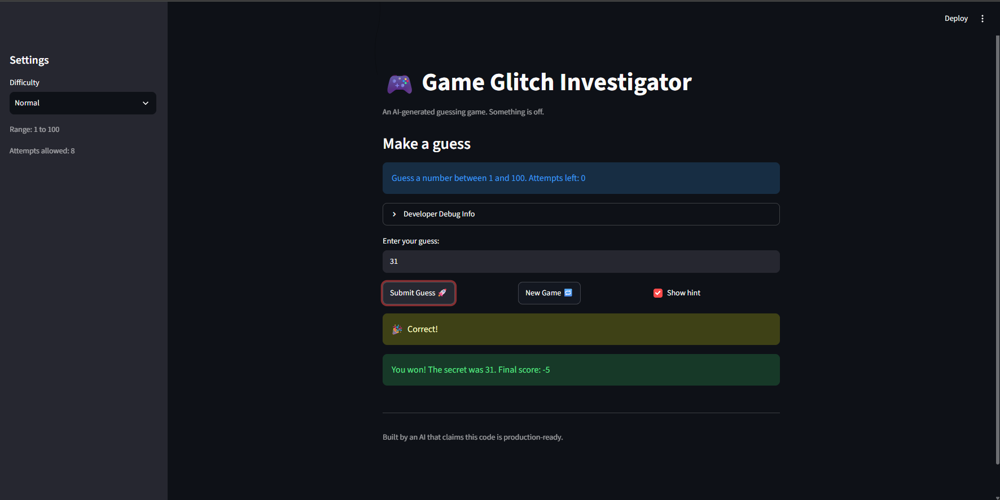

# 🎮 Game Glitch Investigator: The Impossible Guesser

## 🚨 The Situation

You asked an AI to build a simple "Number Guessing Game" using Streamlit.
It wrote the code, ran away, and now the game is unplayable. 

- You can't win.
- The hints lie to you.
- The secret number seems to have commitment issues.

## 🛠️ Setup

1. Install dependencies: `pip install -r requirements.txt`
2. Run the broken app: `python -m streamlit run app.py`

## 🕵️‍♂️ Your Mission

1. **Play the game.** Open the "Developer Debug Info" tab in the app to see the secret number. Try to win.
2. **Find the State Bug.** Why does the secret number change every time you click "Submit"? Ask ChatGPT: *"How do I keep a variable from resetting in Streamlit when I click a button?"*
3. **Fix the Logic.** The hints ("Higher/Lower") are wrong. Fix them.
4. **Refactor & Test.** - Move the logic into `logic_utils.py`.
   - Run `pytest` in your terminal.
   - Keep fixing until all tests pass!

## 📝 Document Your Experience

- [X] Describe the game's purpose.
The purpose of this game is to guess the secret number. There are three modes, Easy, Normal, and Hard, each with different number of guesses and a range that the secret number can be. Whenever the user input's a guess, they are given a message to go higher, go lower, to input a number that is within the specified range, or a message saying they won the game.
- [X] Detail which bugs you found.
   1. UI and random number generator does not update with the difficlties being choosen.
   2. Hints were misguiding and led you to lose the game.
   3. Guesses had no range check and were casted as strings for even attempts.
   4. Invalid or out-of-range guesses used up an attempt.
   5. Clicking "New Game" Did not reset status so the guessing messaged continued to display after a win or loss.
- [X] Explain what fixes you applied.
   1. Updated UI and random number generator based on difficulty.
   2. Fixed the hints system
   3. Fix check_guesses to no longer parse guesses as strings and check if the guess is in valid range
   4. Fixed guess stack for every "New Game"
## 📸 Demo Walkthrough

Describe your fixed game in numbered steps so a reader can follow along without watching a video:

1. User enters a guess of 40
2. Game returns "Too Low"
3. User enters a guess of 70, and the game shows "Too High"
4. Score updates correctly after each guess
5. Game ends after the correct guess

**Screenshot** *(optional)*: <!-- Insert a screenshot of your fixed, winning game here -->

## 🧪 Test Results


```
# Paste your pytest output here, e.g.:
# pytest tests/
# ========================= X passed in 0.XXs =========================
.\.venv\Scripts\python.exe -m pytest 
============================================================= test session starts ==============================================================
platform win32 -- Python 3.14.8, pytest-9.1.1, pluggy-1.6.0
rootdir: C:\Users\there\OneDrive\Documents\Visual Studio Code\ai110-module1show-gameglitchinvestigator-starter
configfile: pytest.ini
testpaths: test
plugins: anyio-4.15.1
collected 35 items                                                                                                                              

test\test_game_logic.py ...................................                                                                               [100%]

============================================================== 35 passed in 2.08s ==============================================================
```
